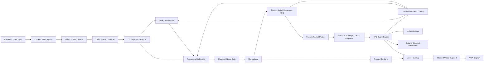

# Privacy-Preserving Corridor Safety Monitor on DE1-SoC

**Project type:** Real-time embedded image processing / FPGA + HPS SoC design  
**Target platform:** Terasic DE1-SoC / Intel Cyclone V SoC  
**Main idea:** Detect corridor safety events such as blocked exits, immobility, loitering, and fall-like situations while avoiding raw-video storage or transmission.  
**Design style:** Use Intel/Terasic IP for video transport and display plumbing; use your own PL/FPGA RTL for privacy-preserving feature extraction; use HPS software for temporal reasoning, configuration, logging, and UI.

---

## 1. Project summary

Build a **privacy-preserving corridor safety monitor** that processes live video on the DE1-SoC and outputs only anonymized information:

- silhouettes
- blob outlines
- occupancy zones
- event labels
- confidence scores
- timestamped metadata logs

The system should **not store, transmit, or display raw identifiable video** in the final operating mode.

The important engineering challenge is not merely detecting motion. The real challenge is building a heterogeneous SoC vision system where:

- the FPGA/PL performs low-latency streaming image processing,
- the HPS performs higher-level reasoning and system control,
- video IP blocks handle standard input/output infrastructure,
- the architecture itself supports a clear privacy guarantee.

A strong project title would be:

> **Privacy-Preserving Real-Time Corridor Safety Monitoring on a DE1-SoC Using FPGA-Based Feature Extraction and HPS Event Reasoning**

---

## 2. Why this is a strong project

This project is impressive because it combines:

1. **A real problem**  
   Shared corridors, labs, schools, and workshops can have safety issues such as blocked exits, people remaining immobile, or someone needing help.

2. **A privacy-first constraint**  
   A normal camera system may create privacy concerns. This project reduces that by processing video locally and only exposing anonymized outputs.

3. **Real SoC engineering**  
   You must divide the design between:
   - Intel IP blocks,
   - custom FPGA logic,
   - HPS software,
   - HPS–FPGA communication,
   - display/output systems.

4. **Clear demonstration value**  
   A live demo can show normal walking, blocked-exit detection, immobility detection, and a safe staged fall-like event using anonymized overlays only.

---

## 3. Core project requirements

### 3.1 Functional requirements

The system should:

- accept live video input;
- convert video into a privacy-preserving representation;
- detect foreground objects or people-like blobs;
- classify simple safety events using time history;
- display an anonymized visualization through VGA;
- send compact metadata from PL to HPS;
- log only event metadata, not raw frames;
- allow tuning of thresholds/zones from HPS software;
- demonstrate at least two reliable event types by the end.

Recommended event types:

1. **Blocked exit / blocked corridor zone**
2. **Immobility / person not moving for too long**
3. **Fall-like posture transition**
4. **Loitering in a restricted region**

For a 3-month project, treat **blocked-zone detection** and **immobility detection** as the main reliable targets. Treat fall-like detection as an advanced feature.

### 3.2 Privacy requirements

The final system should enforce these rules:

- Raw video must not be written to SD card.
- Raw video must not be sent over Ethernet.
- Raw video should not be shown in the final operator display mode.
- Stored logs should contain only metadata, such as:
  - timestamp,
  - event type,
  - zone ID,
  - duration,
  - bounding box or coarse blob features,
  - confidence score.
- Debug modes that show raw frames should be clearly separated from final/demo mode.

Suggested wording for your report:

> The design uses raw video only as a transient signal inside the local processing pipeline. The persistent and operator-visible outputs are limited to anonymized masks, blob descriptors, occupancy maps, and event metadata.

### 3.3 Performance goals

Reasonable targets:

- input resolution: start low, such as 320×240 or 640×480;
- frame rate: 15–30 fps depending on input path and pipeline complexity;
- end-to-end latency: below 250 ms for a good demo;
- event decision latency: 1–5 seconds depending on event type;
- no raw frame storage in final mode;
- stable detection under one controlled corridor-like setup.

Do not over-optimize too early. A reliable low-resolution real-time system is better than a high-resolution system that barely works.

---

## 4. Recommended hardware and software

### 4.1 Required hardware

- Terasic DE1-SoC board
- Power supply
- microSD card for HPS Linux
- VGA monitor or VGA-to-HDMI adapter if needed
- USB-to-UART or serial terminal access
- Ethernet cable if using network dashboard/alerts
- Camera input option

### 4.2 Camera input options

#### Option A — Recommended first path: composite video input

Use the DE1-SoC board’s on-board analog video input path through the ADV7180 TV decoder.

Pros:

- fastest route to live video;
- uses board resources already available;
- good for proving the whole system pipeline.

Cons:

- analog video quality is lower;
- camera availability may be awkward;
- input format may require more careful setup.

#### Option B — Digital camera add-on through GPIO

Use a compatible camera module such as Terasic’s D8M-GPIO or a similar GPIO camera path.

Pros:

- cleaner image;
- more modern camera workflow;
- better if you want a polished visual demo.

Cons:

- more bring-up effort;
- more timing/interface work;
- riskier for a 3-month schedule.

Recommendation:

> Start with the on-board/composite video path if available. Move to a digital camera only after the system architecture works end-to-end.

### 4.3 Required software/tools

You will likely use:

- Intel Quartus Prime, usually the version supported by your course/lab setup;
- Platform Designer/Qsys;
- Intel FPGA IP catalog;
- HPS Linux image for DE1-SoC;
- ARM cross-compilation tools or native compilation on HPS;
- serial terminal such as PuTTY, minicom, or screen;
- Git for version control;
- optional Python on HPS or host PC for log analysis;
- optional OpenCV on host PC for offline prototyping only.

Important note:

> Do not let OpenCV become the main project. You may use it for offline algorithm exploration, but the project should clearly show custom PL image processing and HPS reasoning.

---

## 5. Recommended top-level architecture

### 5.1 Conceptual block diagram



If Mermaid rendering is not available in your editor, treat this as a text block diagram.

### 5.2 Design philosophy

Use this rule throughout the project:

> **IP handles transport. Your RTL handles perception. HPS handles reasoning.**

That keeps the project from becoming either too low-level or too software-heavy.

---

## 6. IP vs custom logic vs HPS ownership

| Area | Use Intel/Terasic IP? | Your custom RTL? | HPS software? | Notes |
|---|---:|---:|---:|---|
| Video input formatting | Yes | No/minimal | No | Use standard video IP where possible. |
| Video stream cleanup | Yes | No/minimal | No | Keep plumbing simple. |
| Color-space conversion | Yes | Maybe | No | Use IP or simple custom Y extraction. |
| Background subtraction | No | Yes | Control only | This should be one of your core PL contributions. |
| Morphology | No | Yes | Tuning only | Good custom RTL module. |
| Blob/region stats | No | Yes | Reads results | Strong ownership area. |
| Event reasoning | No | Maybe partial | Yes | Temporal logic is easier and cleaner on HPS. |
| Privacy rendering | Maybe mixer IP | Yes | Overlay config | Anonymized visualization is a major project feature. |
| VGA output | Yes | No/minimal | No | Use IP. |
| Logging | No | No | Yes | Log only metadata. |
| Dashboard/network alert | No | No | Yes | Optional stretch goal. |

Estimated ownership split:

- IP/infrastructure: **25–35%**
- custom PL/RTL: **30–40%**
- HPS software: **25–35%**

This is a healthy split for a serious SoC project.

---

## 7. Intel IP blocks to investigate

These are the most relevant blocks from Intel’s Video and Image Processing Suite / Platform Designer ecosystem:

- **Clocked Video Input II**
- **Clocked Video Output II**
- **Avalon-ST Video Stream Cleaner**
- **Color Space Converter II**
- **Frame Buffer II**
- **Mixer II**
- **Avalon-ST adapters / Avalon-ST video interfaces**
- **Avalon-MM interconnect**
- **PIO or custom Avalon-MM slave registers**
- **FIFO bridges for metadata transfer**
- **HPS component in Platform Designer**
- **Lightweight HPS-to-FPGA bridge**

Hints:

- Use frame buffers only where they help. A streaming pipeline is usually better for low latency.
- Avoid storing raw frames in HPS memory in final mode.
- For early debugging, it is acceptable to temporarily display raw video, but keep this behind a debug switch.
- Use Avalon-MM registers for simple configuration values.
- Use a FIFO or small RAM buffer for per-frame feature packets if the metadata grows beyond a few registers.

---

## 8. Custom RTL module plan

### 8.1 `y_extract`

Purpose:

- Convert RGB/YUV input into a grayscale or luminance-like stream.

Inputs:

- pixel stream,
- valid/ready or Avalon-ST video control signals,
- frame/line markers.

Outputs:

- 8-bit luminance pixel stream.

Hint:

- If the input is already YCbCr/YUV, use the Y channel directly.
- If RGB, use a cheap approximation first:

```text
Y ≈ (R >> 2) + (G >> 1) + (B >> 2)
```

This is not perfect, but it is hardware-friendly.

### 8.2 `bg_model`

Purpose:

- Maintain a slowly adapting background estimate.

Simple update rule:

```text
background_next = background + alpha * (current - background)
```

Hardware-friendly approximation:

```text
if current > background:
    background += 1
else if current < background:
    background -= 1
```

Only update background when the pixel is likely not foreground, or update slowly enough that stationary people do not immediately disappear.

Useful controls:

- adaptation enable;
- adaptation rate;
- freeze background;
- reset/relearn background.

### 8.3 `fg_subtractor`

Purpose:

- Compare current pixel to background and produce a binary foreground mask.

Basic rule:

```text
abs(current - background) > threshold
```

Output:

- 1-bit foreground mask;
- optional difference magnitude.

Hints:

- Start with a global threshold.
- Add per-region or adaptive thresholding only after the basic version works.
- Lighting flicker and shadows are common false-positive sources.

### 8.4 `shadow_gate`

Purpose:

- Reduce false positives from shadows or lighting changes.

Possible methods:

- ignore very small luminance changes;
- use chroma information if available;
- require local consistency over small neighborhoods;
- suppress blobs that are too thin/diffuse.

Keep this simple. A basic noise gate plus morphology may be enough.

### 8.5 `morph_open_close`

Purpose:

- Clean up the binary foreground mask.

Operations:

- erosion to remove isolated noise;
- dilation to reconnect body regions;
- opening/closing depending on noise pattern.

Implementation hint:

- Use line buffers and a 3×3 window.
- Start with a simple 3×3 majority filter if erosion/dilation takes too long to debug.

Possible 3×3 majority rule:

```text
foreground_out = number_of_foreground_pixels_in_3x3_window >= 5
```

This is easier to implement than full morphology and often works well enough for an MVP.

### 8.6 `region_stats`

Purpose:

- Extract compact information about foreground regions.

Simplest version:

- divide the image into zones/grid cells;
- count foreground pixels in each zone;
- compute total motion energy;
- estimate rough bounding box for all foreground pixels.

Advanced version:

- connected-component labeling;
- multiple blob tracking support;
- per-blob bounding boxes and centroids.

Recommended implementation path:

1. Start with global foreground count and one bounding box.
2. Add zone occupancy grid.
3. Add multi-blob support only if needed.

Basic single-blob stats:

```text
min_x, max_x, min_y, max_y
foreground_pixel_count
sum_x, sum_y
centroid_x = sum_x / foreground_pixel_count
centroid_y = sum_y / foreground_pixel_count
aspect_ratio = height / width
```

Hardware hint:

- Division is expensive. For early versions, send sums/counts to HPS and divide in software.

### 8.7 `occupancy_grid`

Purpose:

- Convert foreground mask into coarse zone occupancy.

Example grid:

- 8×6 zones for 320×240;
- 16×12 zones for 640×480.

Each cell stores:

- foreground pixel count;
- motion activity;
- optional timestamp/decay value on HPS.

This is useful for:

- blocked exit detection;
- restricted-zone loitering;
- heatmap visualization;
- privacy-preserving logs.

### 8.8 `posture_estimator`

Purpose:

- Estimate coarse posture cues without identifying a person.

Useful features:

- bounding box width;
- bounding box height;
- height/width ratio;
- centroid height;
- change in aspect ratio over time;
- motion energy before/after posture change.

PL should compute raw features. HPS should decide events over time.

### 8.9 `event_feature_packer`

Purpose:

- Package PL-computed features into a clean format for HPS.

Example packet:

```c
struct feature_packet {
    uint32_t frame_id;
    uint32_t timestamp_ticks;
    uint16_t fg_count;
    uint16_t min_x;
    uint16_t max_x;
    uint16_t min_y;
    uint16_t max_y;
    uint16_t sum_x_low;
    uint16_t sum_x_high;
    uint16_t sum_y_low;
    uint16_t sum_y_high;
    uint16_t motion_energy;
    uint16_t zone_counts[48]; // for 8x6 grid, optional
};
```

You can simplify this heavily for the MVP.

### 8.10 `privacy_renderer`

Purpose:

- Generate a display-safe output.

Possible render modes:

1. binary silhouette only;
2. blob outline on black background;
3. occupancy grid heatmap;
4. bounding box + event label;
5. side-by-side debug view, disabled in final mode.

Final demo mode should not show raw identifiable video.

---

## 9. HPS software plan

The HPS is responsible for reasoning, state, and human-facing behavior.

### 9.1 Core HPS tasks

- enable HPS–FPGA bridges;
- memory-map FPGA registers;
- read per-frame feature data;
- maintain rolling history of features;
- apply event rules;
- update overlay/control registers;
- log metadata to SD;
- optionally serve a small web dashboard over Ethernet.

### 9.2 Suggested HPS process structure

```text
main loop:
    load config
    initialize bridge/register access
    while running:
        read feature packet or status registers
        update tracker/history
        evaluate events
        update overlay labels/status
        write metadata log when event changes
        handle CLI/UI commands
```

### 9.3 Configuration file

Use a text config file on the HPS so you can tune without recompiling FPGA logic.

Example:

```ini
[video]
width=320
height=240
fps=30

[foreground]
threshold=32
min_fg_pixels=200

[zones]
exit_zone=x0:220,y0:80,x1:319,y1:180
restricted_zone=x0:0,y0:0,x1:100,y1:240

[events]
blocked_seconds=5
immobile_seconds=8
fall_motion_window_ms=1500
fall_stillness_seconds=4
```

### 9.4 Event logic

#### Blocked-zone event

A simple rule:

```text
if foreground occupancy in exit_zone > threshold for N seconds:
    raise BLOCKED_ZONE
else:
    clear BLOCKED_ZONE
```

Add hysteresis:

- require event to be true for several frames before raising;
- require event to be false for several frames before clearing.

#### Immobility event

Possible rule:

```text
if object present and centroid movement < small_threshold for N seconds:
    raise IMMOBILE_OBJECT
```

Avoid false alarms:

- ignore very small blobs;
- ignore static furniture by slowly adapting background only when safe;
- use zone rules to ignore irrelevant areas.

#### Fall-like event

A cautious, high-level rule:

```text
if aspect ratio changes from tall to wide quickly
and motion energy drops afterward
and blob remains present near floor region:
    raise FALL_LIKE_EVENT
```

Important:

- Call this “fall-like detection” or “fall suspicion,” not guaranteed fall detection.
- Do not claim medical-grade reliability.
- For demos, do not perform dangerous real falls. Use a padded mat, a mannequin, a pillow/coat bundle, or a carefully staged low-risk posture transition.

#### Loitering event

```text
if repeated or continuous occupancy in restricted zone for N seconds:
    raise LOITERING_OR_PROLONGED_PRESENCE
```

Use neutral language in your report. “Suspicious” can be subjective. “Prolonged presence in restricted zone” is more precise.

---

## 10. Suggested register map

Use a simple memory-mapped control/status interface first.

Example register map:

| Offset | Name | Direction | Description |
|---:|---|---|---|
| 0x00 | CONTROL | HPS→PL | enable, reset, freeze background, debug mode |
| 0x04 | STATUS | PL→HPS | frame valid, packet ready, overflow flags |
| 0x08 | FRAME_ID | PL→HPS | latest processed frame number |
| 0x0C | FG_THRESHOLD | HPS→PL | foreground threshold |
| 0x10 | MIN_FG_PIXELS | HPS→PL | minimum foreground count |
| 0x14 | FG_COUNT | PL→HPS | total foreground pixels |
| 0x18 | MIN_X | PL→HPS | foreground bounding box min x |
| 0x1C | MAX_X | PL→HPS | foreground bounding box max x |
| 0x20 | MIN_Y | PL→HPS | foreground bounding box min y |
| 0x24 | MAX_Y | PL→HPS | foreground bounding box max y |
| 0x28 | SUM_X_LOW | PL→HPS | centroid accumulation low word |
| 0x2C | SUM_X_HIGH | PL→HPS | centroid accumulation high word |
| 0x30 | SUM_Y_LOW | PL→HPS | centroid accumulation low word |
| 0x34 | SUM_Y_HIGH | PL→HPS | centroid accumulation high word |
| 0x38 | MOTION_ENERGY | PL→HPS | frame-to-frame activity |
| 0x3C | RENDER_MODE | HPS→PL | silhouette, heatmap, outline, debug |

For zone counts, either:

- use a small memory block exposed through Avalon-MM, or
- use a FIFO containing one packet per frame.

Start with the simple register map. Add FIFO/memory later.

---

## 11. Development milestones and checkpoints

The plan below assumes roughly 12 weeks. Adjust based on your course deadlines.

---

### Week 1 — Project setup and board bring-up

Goals:

- confirm Quartus/Platform Designer toolchain;
- boot HPS Linux from microSD;
- confirm serial terminal access;
- confirm VGA output works;
- create Git repository;
- collect board manuals and IP documentation.

Deliverables:

- working “hello world” on HPS;
- simple FPGA design that can be programmed;
- VGA test pattern or basic display output;
- project repository with README.

Checkpoint questions:

- Can you program the FPGA reliably?
- Can you boot Linux and log in?
- Can HPS software run from the command line?
- Can you display anything on VGA?

Hints if stuck:

- Separate HPS boot issues from FPGA design issues.
- Use known working demo images/designs first.
- Do not begin algorithm work until board bring-up is stable.

---

### Week 2 — Video input/output pipeline

Goals:

- get live video into the FPGA pipeline;
- route video to display;
- understand pixel format and timing;
- verify resolution and frame rate.

Deliverables:

- live input shown on VGA in debug mode;
- documented input format;
- notes on resolution, sync, and color format.

Checkpoint questions:

- Do you know whether your stream is RGB, YCbCr, grayscale, or another format?
- Do frame and line boundaries behave as expected?
- Is the video stable for several minutes?

Hints if stuck:

- Reduce resolution if possible.
- Use a test pattern before debugging camera input.
- Inspect valid/ready or start/end-of-packet behavior carefully.
- Keep this stage simple; no privacy transformation yet.

---

### Week 3 — Grayscale / luminance extraction

Goals:

- extract luminance or grayscale;
- display grayscale output;
- verify per-pixel custom RTL integration.

Deliverables:

- `y_extract` module;
- grayscale display mode;
- small simulation or testbench for pixel conversion.

Checkpoint questions:

- Can you insert your own module into the video stream without breaking timing?
- Does the grayscale image look correct?
- Are frame boundaries preserved?

Hints if stuck:

- Make a pass-through module first.
- Add one transformation at a time.
- Register outputs to help timing closure.

---

### Week 4 — Foreground subtraction MVP

Goals:

- implement basic background model;
- implement foreground thresholding;
- display binary foreground mask.

Deliverables:

- `bg_model` module;
- `fg_subtractor` module;
- live binary mask output;
- HPS or switch-controlled threshold.

Checkpoint questions:

- Can the system detect a person entering the scene?
- Does the mask disappear when the scene is empty?
- Does lighting change cause too many false positives?

Hints if stuck:

- Add a “freeze background” control.
- Start with manual threshold tuning.
- Ignore shadows until foreground detection works.

MVP gate:

> By the end of Week 4, you should have live anonymized foreground-mask output. This is the first major proof that the project is viable.

---

### Week 5 — Mask cleanup and simple statistics

Goals:

- clean foreground mask;
- compute foreground pixel count;
- compute one bounding box.

Deliverables:

- 3×3 majority filter or morphology block;
- foreground count;
- bounding box registers;
- simple overlay or displayed box.

Checkpoint questions:

- Are isolated noise pixels reduced?
- Is the bounding box stable enough for HPS logic?
- Does the system still run at target frame rate?

Hints if stuck:

- Use majority filtering before full erosion/dilation.
- Compute one global bounding box before attempting connected components.
- Send raw sums to HPS and do division in software.

---

### Week 6 — HPS–FPGA communication

Goals:

- expose PL features to HPS;
- tune threshold from HPS;
- log basic per-frame metadata.

Deliverables:

- memory-mapped register interface;
- HPS C/C++ or Python utility to read registers;
- metadata log file with frame ID, foreground count, bounding box.

Checkpoint questions:

- Can HPS read changing PL values reliably?
- Can HPS change a threshold without rebuilding the FPGA design?
- Are logs metadata-only?

Hints if stuck:

- Start with one readable counter register.
- Then add one writable threshold register.
- Confirm bridge base addresses carefully.

MVP gate:

> By the end of Week 6, your system should have a full loop: video in → PL features → HPS readout → display/log/control.

---

### Week 7 — Occupancy zones and blocked-zone detection

Goals:

- define corridor zones;
- detect when a region is occupied for too long;
- generate first real event.

Deliverables:

- zone occupancy calculation;
- HPS blocked-zone event logic;
- event log entry;
- on-screen alert label.

Checkpoint questions:

- Can you define an exit/restricted zone in config?
- Can the system distinguish short crossing from prolonged blockage?
- Does hysteresis prevent flickering alerts?

Hints if stuck:

- Do zone logic on HPS first using bounding box intersection.
- Move zone counts into PL only after the HPS version works.
- Use a visible rectangle overlay for calibration.

---

### Week 8 — Immobility detection

Goals:

- track centroid or bounding box over time;
- detect low movement while object remains present;
- reduce false alarms.

Deliverables:

- rolling history buffer on HPS;
- immobility event rule;
- log and overlay for immobility.

Checkpoint questions:

- Can the system tell walking from standing still?
- Does it avoid triggering on empty-scene noise?
- Does the event clear properly when movement resumes?

Hints if stuck:

- Use centroid displacement and foreground count together.
- Require object size above a threshold.
- Use seconds, not frames, in your config values.

---

### Week 9 — Fall-like posture detection

Goals:

- estimate coarse posture from bounding box;
- detect sudden tall-to-wide transition followed by stillness;
- treat this as a suspicion signal, not a guaranteed diagnosis.

Deliverables:

- aspect-ratio tracking;
- motion-before/motion-after feature;
- fall-like event label and confidence score.

Checkpoint questions:

- Does the system avoid triggering on someone simply walking past?
- Does it trigger on a safe staged fall-like test object or posture transition?
- Is the wording in the UI/report appropriately cautious?

Safety note:

> Do not perform dangerous falls for testing. Use a padded setup, a mannequin, a pillow/coat bundle, or a careful low-risk staged posture transition.

Hints if stuck:

- Use this rule only after object size and mask quality are stable.
- Combine aspect ratio, vertical position, and stillness.
- Add confidence scoring instead of hard yes/no only.

---

### Week 10 — Privacy renderer and UI polish

Goals:

- make the final display anonymized and understandable;
- add render modes;
- make event status obvious.

Deliverables:

- silhouette-only display mode;
- occupancy heatmap or zone overlay;
- event banner;
- final privacy mode switch.

Checkpoint questions:

- Can a viewer understand the event without seeing raw video?
- Is raw-video debug mode clearly disabled for final demo?
- Are displayed overlays readable from a distance?

Hints if stuck:

- Do not overdesign the UI.
- Use large labels and simple colors/regions.
- The best demo display is clear, not fancy.

---

### Week 11 — Testing, metrics, and robustness

Goals:

- test the system under repeated scenarios;
- measure latency and false alarms;
- collect data for report.

Deliverables:

- test matrix;
- latency measurements;
- resource utilization summary;
- false positive/false negative notes;
- example event logs.

Suggested test scenarios:

| Scenario | Expected result |
|---|---|
| Empty corridor | No event |
| Normal walking | Foreground detected, no safety alert |
| Person standing briefly | No alert or delayed warning only |
| Exit zone blocked for N seconds | Blocked-zone alert |
| Object/person immobile for N seconds | Immobility alert |
| Safe fall-like staged test | Fall-like suspicion alert |
| Lighting change | Ideally no persistent false alert |
| Small moving object | Ignored if below size threshold |

Metrics to report:

- frame rate;
- approximate latency;
- FPGA resource use;
- number of false alerts in repeated tests;
- detection time for each event;
- log size and privacy properties.

---

### Week 12 — Final integration and presentation

Goals:

- freeze features;
- prepare final demo;
- write report;
- create diagrams and validation tables.

Deliverables:

- final bitstream;
- HPS software package;
- config file;
- final demo script;
- final report diagrams;
- short demo video if allowed.

Checkpoint questions:

- Can the system run from power-on with minimal manual steps?
- Can you explain exactly what is IP and what is your own work?
- Can you justify the HPS/PL split?
- Can you prove raw frames are not stored or transmitted in final mode?

---

## 12. Minimum viable product, target product, and stretch goals

### 12.1 Minimum viable product

A successful MVP should have:

- live video input;
- PL foreground mask;
- anonymized VGA output;
- HPS reads foreground count and bounding box;
- HPS detects one event, ideally blocked-zone detection;
- metadata-only event log.

### 12.2 Strong final target

A strong final system should add:

- cleaned foreground mask;
- occupancy zones;
- blocked-zone detection;
- immobility detection;
- fall-like suspicion;
- event confidence score;
- polished anonymized overlay;
- clear privacy policy in the architecture.

### 12.3 Stretch goals

Only attempt these after the core system works:

- Ethernet dashboard;
- web UI served from HPS;
- multi-blob support;
- adaptive per-zone thresholds;
- heatmap history;
- email/local network alert;
- digital camera upgrade;
- simple hardware performance counters;
- formal privacy mode lockout that disables raw display path.

Avoid:

- full CNN object detection unless everything else is finished;
- complex pose estimation;
- storing raw video clips;
- multi-camera setups;
- too many event types.

---

## 13. Suggested event log format

Use CSV or JSON lines.

### CSV example

```csv
timestamp,event_type,zone_id,duration_s,confidence,fg_count,min_x,max_x,min_y,max_y
2026-02-10T14:32:18,BLOCKED_ZONE,EXIT_A,5.2,0.87,4832,220,306,70,190
2026-02-10T14:36:44,IMMOBILE,ZONE_3,8.0,0.74,3910,120,180,95,210
```

### JSON lines example

```json
{"timestamp":"2026-02-10T14:32:18","event":"BLOCKED_ZONE","zone":"EXIT_A","duration_s":5.2,"confidence":0.87,"features":{"fg_count":4832,"bbox":[220,70,306,190]}}
```

Do not log raw images.

---

## 14. Debugging strategy

### 14.1 Debug in layers

Use this order:

1. FPGA programming works.
2. HPS boots Linux.
3. VGA output works.
4. Video input works.
5. Pass-through video works.
6. Grayscale video works.
7. Foreground mask works.
8. Mask cleanup works.
9. Feature registers work.
10. HPS event logic works.
11. Final anonymized display works.

Never debug all layers at once.

### 14.2 Useful debug modes

Implement these render modes:

| Mode | Purpose | Final demo? |
|---|---|---:|
| Raw pass-through | Bring-up only | No |
| Grayscale | Pixel pipeline debug | No/optional |
| Difference image | Background subtraction debug | No |
| Binary mask | Main anonymized view | Yes |
| Blob outline | Final view | Yes |
| Occupancy heatmap | Final view | Yes |

Keep raw pass-through behind a compile-time or HPS-controlled debug switch.

### 14.3 Common bugs

| Symptom | Likely cause |
|---|---|
| Unstable video | timing, clock, sync, input format issue |
| Entire frame foreground | bad background initialization or threshold too low |
| Person disappears too quickly | background adapts too fast |
| Lots of speckles | noise, threshold too low, no morphology |
| Bounding box jumps | noisy mask or no hysteresis |
| HPS reads nonsense | wrong bridge address, register width, cache/mmap issue |
| Alerts flicker | no event hysteresis or time filtering |
| Timing fails | too much combinational logic in pixel path |

---

## 15. Hints for staying independent

Use this process when stuck:

1. **Reduce the problem.**  
   Test with a static image, test pattern, or one register before debugging the whole system.

2. **Prove one boundary at a time.**  
   Confirm video stream boundaries, then pixel values, then masks, then features, then HPS reads.

3. **Log everything numeric.**  
   Foreground count, bounding box, centroid, and event state transitions are more useful than guessing from the screen.

4. **Keep a lab notebook.**  
   Record thresholds, lighting conditions, bugs, fixes, and commit hashes.

5. **Use IP documentation, not random guesses.**  
   Video IP blocks have specific expectations for Avalon-ST video signals and frame markers.

6. **Avoid perfection traps.**  
   A clean, reliable blocked-zone detector is better than five half-working event types.

7. **Separate debug mode from final privacy mode.**  
   It is acceptable to use raw video during development. It should not be part of the final operating claim.

---

## 16. Report structure suggestion

A strong final report could use this structure:

1. Introduction and motivation
2. Problem statement
3. Privacy requirements and threat model
4. DE1-SoC platform overview
5. System architecture
6. HPS/PL partitioning
7. Video IP integration
8. Custom FPGA image-processing pipeline
9. HPS event reasoning
10. Privacy-preserving output and logging
11. Testing methodology
12. Results and measurements
13. Limitations
14. Future work
15. Conclusion

### Important diagrams to include

- top-level block diagram;
- video pipeline diagram;
- HPS–FPGA register map;
- event state machine;
- privacy data-flow diagram;
- test setup photo or diagram;
- timeline/Gantt chart;
- final display screenshot.

### Important tables to include

- IP vs custom RTL vs HPS responsibilities;
- resource utilization;
- event detection results;
- latency measurements;
- privacy policy compliance checklist;
- risk register.

---

## 17. What to say in a viva/interview

If asked **“What did you actually build?”**, answer along these lines:

> I used standard IP blocks for video input, output, buffering, and display composition, but the foreground extraction, mask cleanup, feature extraction, occupancy estimation, and privacy renderer were custom FPGA modules. The HPS ran the temporal event engine, configuration interface, and metadata logging. The final system was designed so raw frames were not stored or transmitted.

If asked **“Why use the FPGA?”**, answer:

> The pixel-level operations are highly parallel and streaming-friendly, so the FPGA can process every pixel at video rate with low latency. The HPS is better suited for temporal state, thresholds, logging, and user interaction.

If asked **“Why not just use OpenCV?”**, answer:

> OpenCV would be useful for prototyping, but this project is about a hardware/software SoC architecture. The FPGA provides deterministic streaming pre-processing, while the HPS handles decision logic and control.

If asked **“How is privacy enforced?”**, answer:

> The final operating mode exposes only silhouettes, occupancy grids, blob features, and event metadata. Raw frames are not written to storage or transmitted over the network, and the operator display uses anonymized render modes.

---

## 18. Risk register

| Risk | Impact | Mitigation |
|---|---|---|
| Video input bring-up takes too long | High | Start with known demos/test patterns; use available board examples. |
| Camera quality is poor | Medium | Use controlled lighting and lower expectations; consider digital camera only after MVP. |
| Background subtraction fails in changing light | Medium | Add freeze/relearn control, slower adaptation, and zone-based thresholds. |
| Morphology takes too long to implement | Medium | Use 3×3 majority filter first. |
| HPS bridge access is confusing | Medium | Start with one counter register and one writable LED/control register. |
| Too many event types | High | Prioritize blocked-zone and immobility; make fall-like detection a stretch. |
| Timing closure fails | Medium | Pipeline heavily; keep per-pixel logic simple; avoid large combinational blocks. |
| Privacy claim becomes weak | High | Ensure final logs and display do not expose raw video. |
| Demo environment differs from test environment | Medium | Bring your own controlled scene markers and lighting if possible. |

---

## 19. Practical demo script

A clean final demo could run like this:

1. **Show privacy mode**  
   Display only silhouettes/occupancy map. Explain that final mode does not show raw video.

2. **Normal walking**  
   Someone walks through the corridor area. The system tracks motion but does not raise an alert.

3. **Blocked exit**  
   Someone stands in a marked exit zone. After the configured time, the display shows `BLOCKED ZONE`.

4. **Immobility**  
   A person or safe object remains still in a monitored area. The system raises `IMMOBILE` after the threshold.

5. **Fall-like staged event**  
   Use a safe staged object or padded low-risk setup. The display shows `FALL-LIKE EVENT` or `ASSISTANCE MAY BE NEEDED`.

6. **Show metadata log**  
   Open the CSV/JSON log and show that it contains metadata only.

7. **Explain HPS/PL split**  
   Show the architecture diagram and point out custom RTL modules.

---

## 20. Suggested grading/checkpoint rubric

Use this to judge your own progress.

| Category | Basic | Good | Excellent |
|---|---|---|---|
| Video pipeline | Test pattern only | Live video in/out | Stable live anonymized display |
| PL processing | Grayscale only | Foreground mask | Mask + morphology + features |
| HPS integration | Manual controls | Register read/write | Config, logging, event engine |
| Events | One event | Two reliable events | Multiple events with confidence/hysteresis |
| Privacy | Claimed only | No raw logs | Clear privacy architecture and final display |
| Demo | Pre-recorded | Live controlled demo | Live demo with logs and metrics |
| Report | Basic description | Architecture + results | Strong evaluation + limitations |

---

## 21. Resource links

Use official or course-quality resources first.

### DE1-SoC board and hardware

- Terasic DE1-SoC product/resources page:  
  https://www.terasic.com.tw/cgi-bin/page/archive.pl?CategoryNo=167&Language=English&No=836

- Terasic DE1-SoC system CD / downloads page:  
  https://www.terasic.com.tw/cgi-bin/page/archive.pl?CategoryNo=17&Language=English&No=870&PartNo=4

- DE1-SoC user manual PDF mirror:  
  https://www.mouser.com/datasheet/2/598/Terasic_DE1-SoC_User_manual_0C0D-531691.pdf

### Intel FPGA video IP

- Intel Video and Image Processing Suite User Guide:  
  https://www.intel.com/programmable/technical-pdfs/683416.pdf

- Intel online documentation page for the Video and Image Processing Suite:  
  https://docs.altera.com/r/docs/683416/current

### HPS / Linux / HPS-FPGA bridge references

- Intel FPGA University Program DE1-SoC Computer Manual:  
  https://fpgacademy.org/Downloads/DE1-SoC_Computer_ARM.pdf

- Intel tutorial: Using Linux on DE-series Boards:  
  https://ftp.intel.com/Public/Pub/fpgaup/pub/Intel_Material/17.0/Tutorials/Linux_On_DE_Series_Boards.pdf

- Cornell ECE5760 DE1-SoC Linux notes and examples:  
  https://people.ece.cornell.edu/land/courses/ece5760/DE1_SOC/

### Optional camera resource

- Terasic D8M-GPIO camera module page:  
  https://www.terasic.com.tw/cgi-bin/page/archive.pl?CategoryNo=68&Language=English&No=1011

### General FPGA/video debugging topics to search

Use these search phrases when stuck:

- `Avalon-ST video startofpacket endofpacket valid ready`
- `DE1-SoC HPS lightweight bridge mmap C example`
- `Cyclone V HPS FPGA bridge enable Linux`
- `DE1-SoC ADV7180 video input example`
- `Intel Clocked Video Input II example design`
- `FPGA 3x3 morphology line buffer Verilog`
- `background subtraction FPGA Verilog`
- `connected components FPGA streaming binary image`

---

## 22. Personal working rules for this project

These rules will help you keep ownership while still using resources wisely.

1. **Build the smallest full system early.**  
   A rough end-to-end pipeline beats isolated perfect modules.

2. **Keep IP use honest.**  
   Use IP for infrastructure. Clearly identify your own RTL and software contributions.

3. **Prefer deterministic classical vision.**  
   The DE1-SoC is well suited to streaming image processing. Do not jump to deep learning unless the classical system is already complete.

4. **Make privacy a design feature, not a paragraph at the end.**  
   Every output path should be checked against the privacy rule.

5. **Treat fall detection carefully.**  
   Call it fall-like detection or assistance-needed detection. Avoid overclaiming reliability.

6. **Design for your demo environment.**  
   A controlled corridor-like setup is acceptable. Document the constraints clearly.

7. **Measure something.**  
   Latency, resource use, event detection time, and false alerts make the project look much more serious.

8. **Freeze features before the final two weeks.**  
   The last two weeks are for reliability, testing, and presentation, not major redesigns.

---

## 23. Final project success definition

A successful version of this project is not one that recognizes every possible human activity. A successful version is one that:

- runs live on the DE1-SoC;
- uses both the HPS and PL meaningfully;
- uses IP blocks appropriately without hiding the main engineering work;
- includes custom FPGA image-processing modules;
- detects at least two useful corridor safety events;
- displays anonymized outputs only in final mode;
- logs metadata only;
- includes measured results and a clear explanation of limitations.

If you complete that, you will have a strong, practical, and defensible SoC image-processing project.
