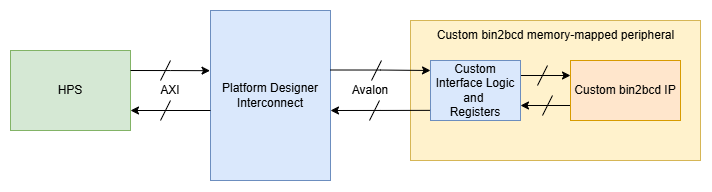
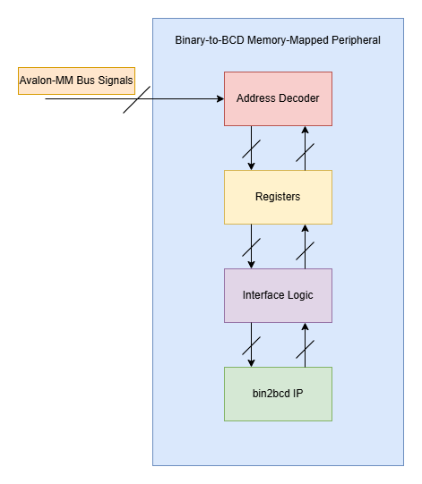

# Memory-mapped design: bin2bcd_mm  

The `bin2bcd_mm` is a custom avalon-bus-compliant binary-to-bcd memory-mapped peripheral designed and implemented by Olaoluwa Raji and tested on the Terasic DE1-SoC board. The custom `bin2bcd` IP is generic and can easily be ported to another FPGA/SoC board.  

## Hardware Design  

### Overview
In order to facilitate two-way communication between a hard processor and custom IP which resides in the FPGA fabric of an SoC, we need to leverage the SoC manufacturer's supported on-chip bus protocols. The Terasic board uses an Altera Cyclone V SoC which contains a hard processor (HPS) capable of communicating with other on-chip components using the AXI protocol. In this design, the `bin2bcd_mm` peripheral is implemented on the FPGA side of the Altera SoC and it understands the Avalon protocol. The Intel Platform Designer tool is required to generate the interconnect logic that translates the AXI signals from the HPS to the Avalon signals the `bin2bcd_mm` peripheral understands. At the end of the day, we want the processor to send binary data to the `bin2bcd` IP and receive BCD data from it. The processor will run a simple C application on top of the Linux kernel.  

    

  

### Peripheral architecture

    

  

## Programmer's Model  

| Register | Offset | Access | Description
| :---: | :---: | :---: | --- 
| Status | 0x00 | R | Provides information about the peripheral's state to the HPS/software.  Bit 0 `(BUSY)` is set when a binary-to-bcd conversion is ongoing and cleared if not. The `BUSY` bit must be cleared before the HPS/software sends data to the `Input Data Register (IDR)`. Bit 1 `(DONE)` is set when a conversion is completed. The `DONE` bit must be set before the HPS/software can read valid BCD data. The `BUSY` and `DONE` bits are set/cleared by hardware and are both read-only. The remaining bits in this register are reserved and set to 0 by hardware.    
| Control | 0x04 | R/W | 
| Input Data | 0x08 | R/W | 
| Output Data | 0x0C | R | 

### Status Register (SR) 

### Control Register (CR) 

### Input Data Register (IDR) 

### Output Data Register (ODR) 

